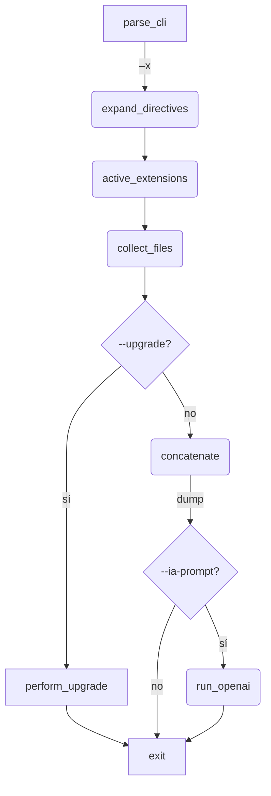

## ghconcat — Concatenador inteligente de código con súper‑poderes IA

> **Desarrollado por GAHEOS**

---

### Índice

1. [Características principales](#características-principales)
2. [Requisitos](#requisitos)
3. [Instalación](#instalación)
4. [Configuración del entorno](#configuración-del-entorno)
5. [Uso rápido](#uso-rápido)
6. [Referencia completa de opciones](#referencia-completa-de-opciones)
7. [Archivo de directivas `‑x`](#archivo-de-directivas-x)
8. [Ejemplos prácticos](#ejemplos-prácticos)
9. [Integración con IA](#integración-con-ia)
10. [Actualización automática `--upgrade`](#actualización-automática--upgrade)
11. [Manejo de errores y depuración](#manejo-de-errores-y-depuración)
12. [Flujo interno](#flujo-interno)
13. [Contribuir](#contribuir)
14. [Licencia](#licencia)

---

### Características principales

* **Multi‑lenguaje** `*.py, *.dart, *.xml, *.js, *.csv, *.yml` / `*.yaml`.
* **Filtros inteligentes** — elimina comentarios (`-c / -C`), `import`, `export`, líneas en blanco, etc.
* **Concatenación o lista de rutas** (`-t`).
* **Directivas externas** (`-x build.txt`) para configurar tareas reproducibles.
* **Exclusiones avanzadas** `‑e` (patrón) y **`‑E`** (árboles completos).
* **Alias Odoo** `--odoo` y banderas negadas `--no-*`.
* **Actualizador sin dolor** `ghconcat --upgrade`.
* **IA integrada** — envía el dump a ChatGPT y guarda la respuesta (`--ia-*`).
* **UX cuidada** — mensajes claros, sin *tracebacks*; `DEBUG=1` habilita traza completa.

---

### Requisitos

* **Python ≥ 3.8**
* (Opcional) **openai ≥ 1.0** si vas a usar `--ia-*`

---

### Instalación

```bash
git clone https://github.com/GAHEOS/ghconcat.git
cd ghconcat
python3 setup.py install   # copia ~/.bin/ghconcat y lo hace ejecutable
```

El instalador imprimirá un recordatorio para:

1. Exportar la variable **`OPENAI_API_KEY`** (si usarás IA).
2. Asegurarte de que **`~/.bin`** está en tu `PATH`, por ejemplo:

```bash
echo 'export PATH="$HOME/.bin:$PATH"' >> ~/.zshrc
source ~/.zshrc
```

---

### Configuración del entorno

```bash
# añadir a ~/.bashrc, ~/.zshrc, etc.
export OPENAI_API_KEY="sk-…"
export PATH="$HOME/.bin:$PATH"
```

`DEBUG=1` activa el *traceback* completo para depuración.

---

### Uso rápido

```bash
# 1. Concatenar todo un módulo Odoo (py+xml+js+csv) limpio de comentarios e imports
ghconcat -a addons/my_module --odoo -c -i -f dump.txt

# 2. Revisar con IA usando un prompt plantila y guardar la respuesta
ghconcat -a addons/my_module --odoo -C -i -I \
         --ia-prompt=review.md --ia-output=analysis.md
```

---

### Referencia completa de opciones

| Flag                                     | Descripción                                                           |
| ---------------------------------------- |-----------------------------------------------------------------------|
| **`-a PATH`**                            | Añade carpeta o archivo individual al recorrido (repetible).          |
| **`-e PATRÓN`**                          | Excluye rutas cuyo *path* contenga el patrón (repetible).             |
| **`-E DIR`**                             | Prune de directorio completo (no entra ni lista sub‑archivos).        |
| **`-p SUF`**                             | Solo incluye archivos cuyo **basename** termine en SUF.               |
| **`-f FILE`**                            | Fichero de salida (`dump.txt` por defecto).                           |
| **`-t`**                                 | Solo lista las rutas; no concatena contenido.                         |
| **`-c / -C`**                            | Elimina comentarios simples / simples + doc (solo Py/Dart).           |
| **`-S`**                                 | Conserva líneas en blanco.                                            |
| **`-i / -I`**                            | Elimina `import` / `export`.                                          |
| **`--py --dart --xml --csv --js --yml`** | Activa extensiones (si ninguna ⇒ `.py`).                              |
| **`--odoo`**                             | Atajo a `--py --xml --js --csv`.                                      |
| **`--no-py --no-xml --no-js --no-csv`**  | Desactiva extensiones concretas.                                      |
| **`--ia-prompt FILE --ia-output FILE`**  | IA: prompt plantilla (**{dump\_data}**) + destino.                    |
| **`-x FILE`**                            | Lee directivas externas (ver más abajo).                              |
| **`--upgrade`**                          | Descarga y reemplaza `~/.bin/ghconcat` con la última versión oficial. |
| **`-h / --help`**                        | Ayuda concisa.                                                        |

---

### Archivo de directivas `-x`

Permite empaquetar una tarea compleja en un único fichero (ideal CI/CD).

#### Reglas de sintaxis

* **Líneas en blanco** y líneas que empiezan con `#` se ignoran.
* Todo lo que siga a `//` se elimina (comentario en línea).
* Si la línea **empieza con “‑”** se copia tal cual.
* Si no empieza con “‑», se asume `‑a` (ruta).

#### Ejemplo `build.txt`

```txt
# Dump completo del módulo, salvo tests
addons/mi_modulo              // -a implícito
-E addons/mi_modulo/tests
-e *.pot                      // descartar ficheros de traducción
--odoo                        // .py + .xml + .js + .csv
-C -i -I                      // limpiar a tope
-f dump.txt

# Enviar a IA
--ia-prompt=review.md
--ia-output=response.md
```

```bash
ghconcat -x build.txt
```

---

### Ejemplos prácticos

| Caso                                                            | Comando                               |        |
| --------------------------------------------------------------- | ------------------------------------- | ------ |
| Concatenar solo **Dart** ignorando `*.g.dart` y líneas `export` | `ghconcat -a lib --dart -I`           |        |
| Dump de **solo CSV** excepto directorio `seed`                  | `ghconcat -a data -E data/seed --csv` |        |
| Limpieza mínima (mantén comentarios doc, importa IA)            | `ghconcat -a src --py -c -S`          |        |
| Resultado a `stdout` y cortar 10 primeras líneas                | \`ghconcat -a addons --odoo -t        | head\` |
| Actualizar a última versión                                     | `ghconcat --upgrade`                  |        |

---

### Integración con IA

1. Crea un prompt plantilla (`prompt.md`) con la marca **`{dump_data}`**:

   ````md
   ## Revisión de código

   Analiza el siguiente código y genera sugerencias de seguridad
   y rendimiento:

   ```python
   {dump_data}
   ````

   ```
   ```
2. Ejecuta:

   ```bash
   ghconcat -a addons/my_module --odoo -C -i -I \
            --ia-prompt=prompt.md --ia-output=review.md
   ```
3. Lee la respuesta formateada en Markdown en `review.md`.

---

### Actualización automática `--upgrade`

```bash
ghconcat --upgrade
```

Clona el repo oficial, localiza `ghconcat.py`, lo copia a `~/.bin/ghconcat`, lo hace ejecutable y limpia temporales.
*Si no usas claves SSH, modifica tu `~/.ssh/config` o reemplaza la URL por HTTPS.*

---

### Manejo de errores y depuración

* Los errores previstos se muestran como
  `Error: descripción clara`
  sin *traceback*.
* `KeyboardInterrupt` finaliza con código **130** y mensaje breve.
* Usa `DEBUG=1` para ver la traza completa:

```bash
DEBUG=1 ghconcat ...
```

---

### Flujo interno



---

### Contribuir

1. Haz *fork* y crea una rama descriptiva.
2. Respeta PEP 8 y añade tests si es posible.
3. Envía *pull request* bien documentado.

---

### Licencia

© 2025 **GAHEOS S.A.** — MIT License.
Consulta `LICENSE` para más detalles.

---

¡Disfruta de la potencia de **ghconcat** y mantén tu código impecable!
